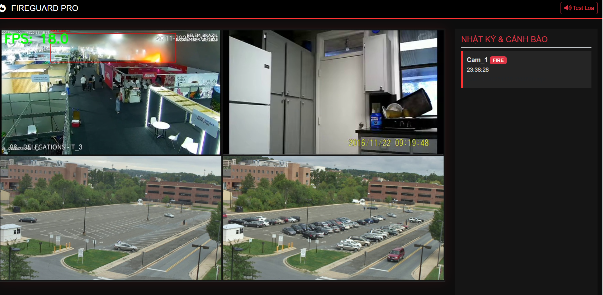

# PyroAlertAI Multi-Stream 🔥

A real-time multi-stream fire detection and alert system using
**YOLOv8**, **Flask**, and integrated **Telegram + Email
notification**.\
This project supports simultaneous multi-camera monitoring, event-based
video recording, and immediate alert dispatch.

------------------------------------------------------------------------

## 🚀 Key Features

### 🔥 1. Real-time Fire Detection

-   Uses **YOLOv8** (Ultralytics) for detecting smoke/fire.
-   Frames are resized to *640×640* for optimal AI performance.

### 🎥 2. Multi-Camera Streaming (Multi-Stream)

-   Supports multiple video sources.
-   Displays all camera feeds in a responsive **mosaic grid layout**.
-   Real-time FPS monitoring.

### 📢 3. Instant Notifications

Supports: - **Telegram Bot Alerts** - **Email Alerts with Image
Attachments** - Cooldown timer to prevent spamming alerts.

### 🎬 4. Automatic Event Recording

-   Records **2 seconds before** and **3 seconds after** the fire event.
-   Saves alert videos automatically to `/runs/alerts`.

### 🌐 5. Modern Web Dashboard

-   Flask-powered monitoring dashboard.
-   Real-time multi-stream video feed.
-   Displays recent alert history.

------------------------------------------------------------------------

## 🖼️ Demo Screenshot

------------------------------------------------------------------------

## 📁 Project Structure

    ├── app.py
    ├── requirements.txt
    ├── models/
    │   ├── Yolov8s-50epochs.pt
    │   ├── Yolov8s-50epochs.engine
    ├── videos/
    │   ├── firevid1.mp4
    │   ├── nonfirevid1.mp4
    ├── runs/
    │   └── alerts/
    ├── templates/
    │   └── index.html
    └── assets/

------------------------------------------------------------------------

## ⚙️ How to Run

### 1️⃣ Install Dependencies

    pip install -r requirements.txt

### 2️⃣ Configure Notification Settings

Edit the following fields inside **app.py**: - `TELEGRAM_TOKEN` -
`TELEGRAM_CHAT_ID` - `EMAIL_SENDER` - `EMAIL_PASSWORD` -
`EMAIL_RECEIVER`

### 3️⃣ Start the Server

    python app.py

### 4️⃣ Open the Dashboard

    http://127.0.0.1:5000

------------------------------------------------------------------------

## 📦 Output

All alert videos are automatically saved in:

    /runs/alerts/

Notifications will also include a snapshot of the detected fire.

------------------------------------------------------------------------

## 🧠 Technologies Used

-   YOLOv8 (Ultralytics)
-   Flask
-   OpenCV
-   SMTP Email
-   Telegram Bot API
-   Python Threading

------------------------------------------------------------------------

## 👨‍💻 Author

Tien Quoc Bao -- PyroAlertAI Multi-Stream System v1.0
